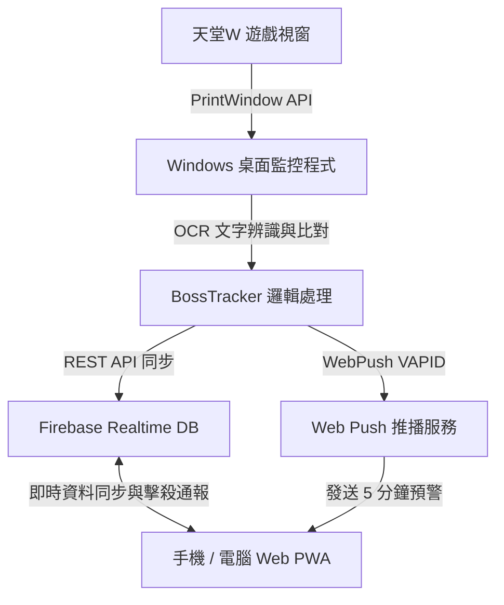

# 天堂W Boss追蹤系統 (Lineage W Boss Tracker)

一個為《天堂W》血盟設計的自動化 BOSS 出現與擊殺計時工具。包含 **Windows 桌面端擷圖辨識程式** 與 **手機/電腦 Web 介面 (PWA)**。

---

## 📌 功能特點

### 桌面監控端 (Windows / Python)
- **多視窗辨識**：自動搜尋並同時監控多個《天堂W》遊戲視窗。
- **後台視窗擷圖**：使用 Win32 API 進行 PrintWindow 後台擷圖，遊戲被遮擋或置於背景時仍可正常辨識。
- **OCR 對話辨識**：採用 PaddleOCR 辨識對話框，配合黃色文字濾鏡與二值化預處理，減少雜訊干擾。
- **訊息過濾與黑白名單**：
  - 含有設定之 BOSS 名稱訊息自動優先保護，避免被過濾規則誤刪。
  - 支援黑名單與 `*` 萬用字元排除雜訊（如 `*獲得*`、`*卡片*`）。
  - 支援常見簡繁轉換與簡化同義字比對（如 `擊敗`、`出現`、`死亡`、`重生`）。
- **去重與穩定性**：單行對話歷史比對，訊息被刪除或編輯時不影響去重；網路連線與辨識迴圈解耦，確保長時間運作穩定。

### 網頁 / 手機介面 (Web / PWA)
- **動態時間軸 (1小時 / 3小時 切換)**：
  - 提供 `1小時` 與 `3小時` 兩種範圍切換。
  - 時間軸左側固定維持過去 30 分鐘 (`-30m`)，右側呈現未來預計重生時間。
- **即時次序鏈**：依照頭目重生順序排列，方便確認下一個重生目標。
- **手動通報與同步**：
  - 可在手機網頁上點擊 `剛擊殺` 或指定時間進行通報。
  - 網頁端會自動根據設定的 CD 計算並更新至雲端，電腦未開機時也能單獨運作。
  - 帶有歷史通報備份還原機制，防止資料遺失。
- **預警提醒 (音效 + 系統推播)**：
  - 支援重生前 5 分鐘音效提醒。
  - 支援網頁原生推播與 iOS / Android 手機 PWA 背景通知。

---

## 📐 系統架構



---

## 🛠️ 安裝與執行

### 1. 桌面端 (Windows)

#### 環境需求
- Windows 10 / 11 (64-bit)
- Python 3.9 或以上

#### 執行步驟
```bash
# 複製專案
git clone https://github.com/alex43021/lineage-w-tracker.git
cd lineage-w-tracker

# 安裝套件
pip install -r requirements.txt

# 執行主程式
python main.py
```

---

### 2. 網頁端 (GitHub Pages 部署)

可直接將 `web` 資料夾部署於 **GitHub Pages** 或其他靜態網頁託管服務：

1. 將本專案 Push 至 GitHub 儲存庫。
2. 至專案 **Settings** ➔ **Pages**。
3. **Source** 選擇 `Deploy from a branch`，Branch 選擇 `main` / `/root` (或 `/web`) 後儲存。
4. 完成後即可取得網頁連結（如 `https://username.github.io/lineage-w-tracker/`）。

#### 手機安裝為 APP (PWA)
- **iOS (Safari)**：點選分享按鈕 ➔ 「加入主畫面」。
- **Android (Chrome)**：點選選單 ➔ 「安裝應用程式」或「新增至主畫面」。

---

## ⚙️ Firebase 資料庫設定

專案使用 **Firebase Realtime Database** 進行雙端資料同步：

1. 前往 [Firebase Console](https://console.firebase.google.com/) 建立專案。
2. 建立 **Realtime Database**（建議選擇亞洲區域）。
3. 於資料庫 **規則 (Rules)** 修改為開放讀寫：
   ```json
   {
     "rules": {
       ".read": true,
       ".write": true
     }
   }
   ```
4. 複製 Database URL（如 `https://xxx-default-rtdb.asia-southeast1.firebasedatabase.app`）。
5. 於桌面端程式的 **系統設定** 頁面填入資料庫網址與通行碼。

---

## 📋 規則與排除設定

### BOSS 規則設定
可在桌面介面中新增或變更 BOSS 資訊：
- **BOSS 名稱**：例如 `巴風特`
- **出現關鍵字**：以逗號分隔，例如 `巴風特, 出現`
- **擊敗關鍵字**：以逗號分隔，例如 `巴風特, 擊敗`
- **CD 時間 (分鐘)**：例如 `240`

### 排除訊息 (黑名單)
可用於過濾非相關系統訊息，支援 `*` 萬用字元：
- `*獲得*`
- `*卡片*`
- `*已登入*`

*備註：若訊息包含已設定之 BOSS 名稱，會優先視為有效訊息，不會被黑名單過濾。*

---

## 📄 授權

本專案採用 [MIT License](LICENSE) 授權。
